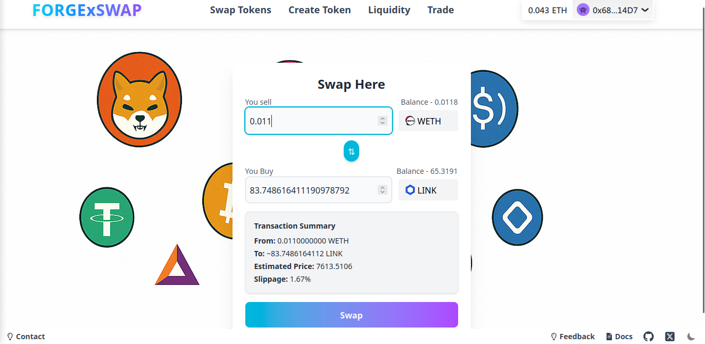
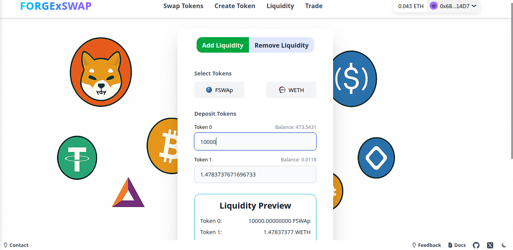

# 🔁 ForgeXSwap

**ForgeXSwap** is a decentralized exchange (DEX) built on the Sepolia Testnet, powered by the core logic of **Uniswap V2's Automated Market Maker (AMM)** protocol. It is designed as a modern and developer-friendly DeFi platform that enables users to create tokens, provide liquidity, and swap assets — all through secure, permissionless smart contracts. ForgeXSwap serves as both a real-world functional dApp and a learning environment for understanding how decentralized exchanges work under the hood.

At its heart, ForgeXSwap provides complete on-chain functionality for:

- 🪙 **ERC20 Token Creation**: Deploy your own fungible tokens with customizable parameters directly from the UI.
- 💧 **Liquidity Provisioning**: Add and remove liquidity for any token pair, earn swap fees, and view your pool share.
- 🔄 **Token Swapping**: Instantly swap between any available ERC20 token pairs using a router that mirrors Uniswap V2’s logic.
- 📈 **Live Charting and Trade Metrics**: Visualize price movements, token ratios, and slippage with real-time ApexCharts-based data presentation and subgraph indexing using the graph.

This project isn’t just a DEX — it's a demonstration of how powerful and modular Web3 applications can be. Whether you're a user who wants to test liquidity strategies on a safe testnet environment or a developer looking to dive deep into DeFi protocols, **ForgeXSwap** offers a fully transparent and extensible platform to experiment with decentralized finance.

### ✨ Why ForgeXSwap?

- Built with beginner and intermediate blockchain developers in mind
- Helps users understand AMM logic, token pricing, and liquidity math
- Deployable on any EVM-compatible chain with minimal changes
- Acts as a base template for building your own DeFi protocols

ForgeXSwap stands at the intersection of usability and education — perfect for learning, testing, and building in the decentralized Web3 space.

This project combines powerful blockchain tools with modern UI for an intuitive and secure trading experience.

---

## 🚀 Features

- 🔨 **ERC20 Token Creation**  
  Easily deploy custom tokens with a single click.

- 🔁 **Token Swaps**  
  Swap between any ERC20 token pairs instantly.

- 📈 **Trading View**  
  View real-time trade charts powered by subgraphs.

- 💧 **Liquidity Pools**  
  Add/remove liquidity and track pool reserves.

- 🔍 **Token Search & Preview**  
  Search tokens with logos, symbols, and metadata before interacting.

---
## 🛠 Tech Stack

| Layer             | Technologies Used                                    |
|------------------|------------------------------------------------------|
| **Frontend**      | React, TailwindCSS, ApexCharts                      |
| **Wallet/Blockchain Integration** | Wagmi, RainbowKit, Ethers.js                      |
| **Smart Contracts** | Solidity, Hardhat, OpenZeppelin Contracts          |
| **Backend API**   | Node.js, Express, Mongoose (MongoDB)                |
| **Data Indexing** | Subgraph (Graph Protocol)                           |
| **Infrastructure**| Sepolia Testnet, IPFS (for token logos, optional)   |


---

## 📸 UI Preview

> *Add screenshots here of your UI (home, swap, token creation, etc.)*
### 🔄 Swap Page


### Trade Page


### 💧 Add Liquidity 



## 🧪 Run Locally

### 🔧 Prerequisites

- Node.js and npm installed
- MongoDB Atlas URI
- Alchemy RPC key (Sepolia)
- IPFS JWT (Pinata, optional)
- Subgraph authentication and URL

---

### 1. Clone the Repository

```bash
git clone https://github.com/surajsbhoj0101/FORGExSWAP

```
****
### 1. Frontend Setup
```bash
cd FORGEXSWAP
npm install
```

### 2. Get API key
- VITE_ALCHEMY_RPC=<your_rpc_url>
- VITE_FACTORY_CONTRACT=<deployed_factory_address>
- VITE_GRAPH_URL=<your_subgraph_url>
- VITE_PINATA_JWT=<optional_if_using_IPFS>

### 3. Start 
```bash
npm run dev
```
***
### 1. Backend setup
```bash
cd Backend
npm install
```

### 2. Setup mongodb atlas
- Get mongo uri

### 3. Start sever
```bash
 npm run backend
```

***
### Smart Contract deployment
```bash
npm install
```
- Get api key
 - create account in alchemy and get api key and url for rpc
  
- Compile and deploy the factory Contract
```bash
npx hardhat compile
npx hardhat run scripts/deploy.mjs --network sepolia
```

### 4. Get the factory contract address and use it in frontend token create utility
***
### subgraph setup
```bash
cd subgraphForPriceFeed
graph codegen && graph build
```
- Create account in graph.com and get the authentication key and deploy
```bash
graph deploy sepolia-v-2-price-feed
```
- Get graph key and Url , use it frontend
***
### 📚 Learning Resources
- Uniswap V2 AMM mechanics
- Liquidity pool mathematics
- Decentralized exchange architecture
- The Graph protocol for data indexing

# 🤝 Contributing
- Contributions are welcome! Please open an issue or submit a PR for any improvements.

